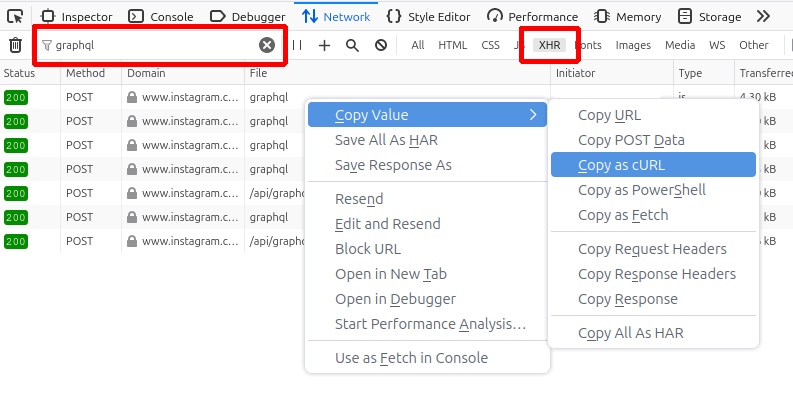
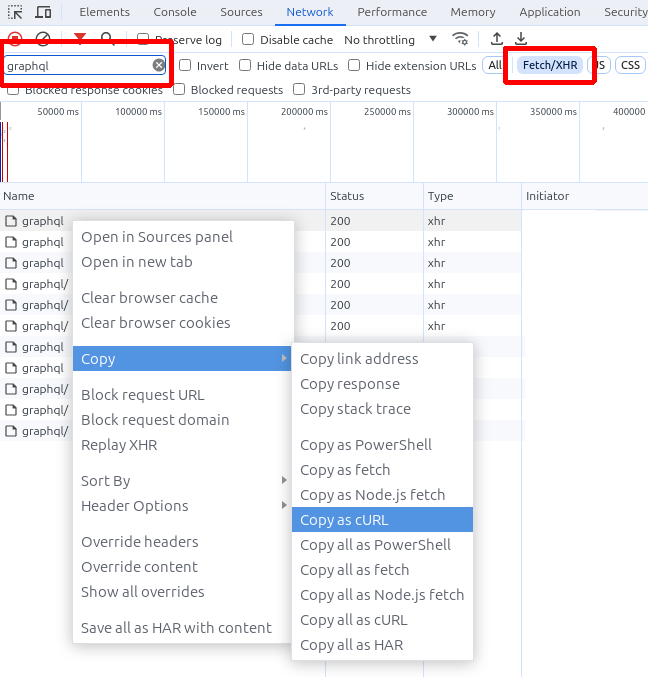

# Authentication
0. Open a private chat with the bridge bot. Usually `@instagrambot:your.server` or `@facebookbot:your.server`
   * If the bot doesn't accept the invite, see the [troubleshooting page](../../general/troubleshooting.md)
1. Send `login` to the bridge bot. The bot should ask you to paste cookies,
   which will happen in step 6.
2. Open the website (facebook.com or instagram.com) in a private window.
3. Open browser devtools and go to the network tab.
   Select "XHR" as the request type and search for `graphql`.
4. Log in normally.
5. Right click one of the requests in devtools,
   choose "Copy" (Chrome) or "Copy Value" (Firefox), then "Copy as cURL".
   * Any request with the correct cookies should work, graphql is just used
     as an example that should be easy to find.
   * Note for windows users: Make sure to select "Copy as cURL (POSIX)",
     not "(Windows)", if given both options.
   * You can also find the cookies manually and send them to the bot as a
     simple key-value JSON object. The relevant cookies are:
     * Instagram: `sessionid`, `csrftoken`, `mid`, `ig_did`, `rur` `ds_user_id`, `shbid`, `shbts`
     * Facebook: `datr`, `c_user`, `sb`, `xs`
6. Paste the copied data to the bridge bot.
7. The bot should inform you of a successful login and sync recent chats.

