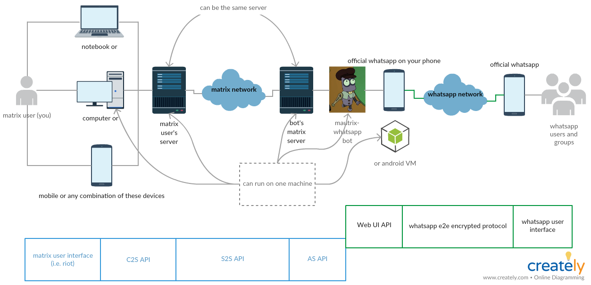

# mautrix-whatsapp
Welcome to the mautrix-whatsapp docs!

## How The Components Fit Together

(Image by [Азат](http://matrix.to/#/@azata:gazizova.net))

This bridge is the component labeled "mautrix-whatsapp bot".

## Discussion
Matrix room: [#whatsapp:maunium.net](https://matrix.to/#/#whatsapp:maunium.net)

In case you need to upload your logs somewhere, be aware that they contain your
contacts' and your phone numbers. Strip them out with `| sed -r 's/[0-9]{10,}/📞/g'`
